# SMART ENTRY - FACE RECOGNITION

Making a system that recognizes faces.

## General info

This project is a starting guide to how to set up Python, Pycharm and opencv. Besides that we're going to focus on face detection. For this you need a computer with a webcam. You can also use an external webcam, meaning you will have to write more codes in order to make that succeed. In this lesson we’re only going to focus on a computer with an internal webcam.

#### Technologies:

- Pycharm
- Python
- Opencv
- Haarcascade

## Step 1: Installing Python

1. Go to https://www.python.org/downloads/ and download Python for the operating system of your computer.
2. Follow the instructions of your computer once downloaded and make the installation complete.
3. After that’s done, you can check if Python is installed on your computer. Do so by opening the terminal and inserting the following command: `python3 --version`.

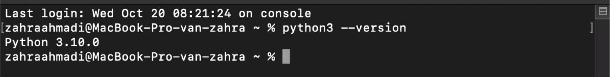

As you can see the version of your Python is being displayed and this means that the installation was succesfull and that you have this software now running on your computer.

Great job, the first step is done!

## Step 2: Installing Pycharm

Now normally you can also write Python code in your regular text editor, but for the ease that comes with Pycharm, we are going to use that. I would recommend using Pycharm, instead of your regular text editor, for that’s technically a little more challenging. Pycharm takes some time to get used to it, but at least here we have everything at the same place and we don’t really need the terminal.

1. Go to https://www.jetbrains.com/pycharm/download/#section=mac and select your operating system and download the community version of Pycharm (this is free and open-source).
2. Follow the instructions of your computer once downloaded and make the installation complete.
3. After that’s done open Pycharm and follow the instructions of the program and make a new project. And now we can finally start making the first steps towards actually writing our code.

## Step 3: Installing Opencv

Opencv is a package for Python and it is needed for the making of face recognition apps.

1. Underneath your Pycharm project there are some buttons. Click on Python Packages.

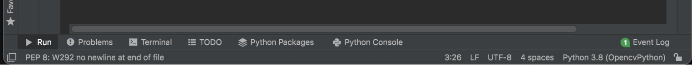

2. Now you have opened a new window where you can also search for packages. Now type opencv-python in the search bar and install it.

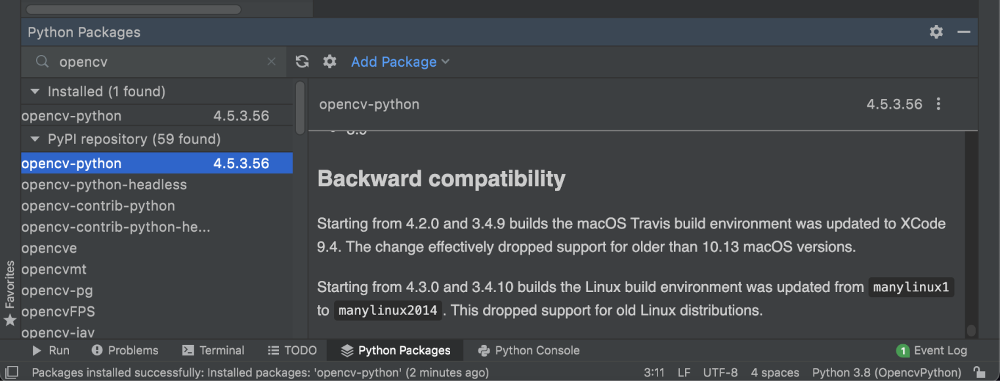

It’s done. Now it’s coding time!

## Step 4: Importing opencv and writing code

First we need to import the package that we just have installed. We do that by writing the following code: `import cv2`.

You can check if that’s done succesfully by running: `print(“package imported”)`

Now does remind ‘print’ to another familiar thing in coding? Yes, it’s the same as console.log in Javascript, for example. With print you send things to the console of Python.

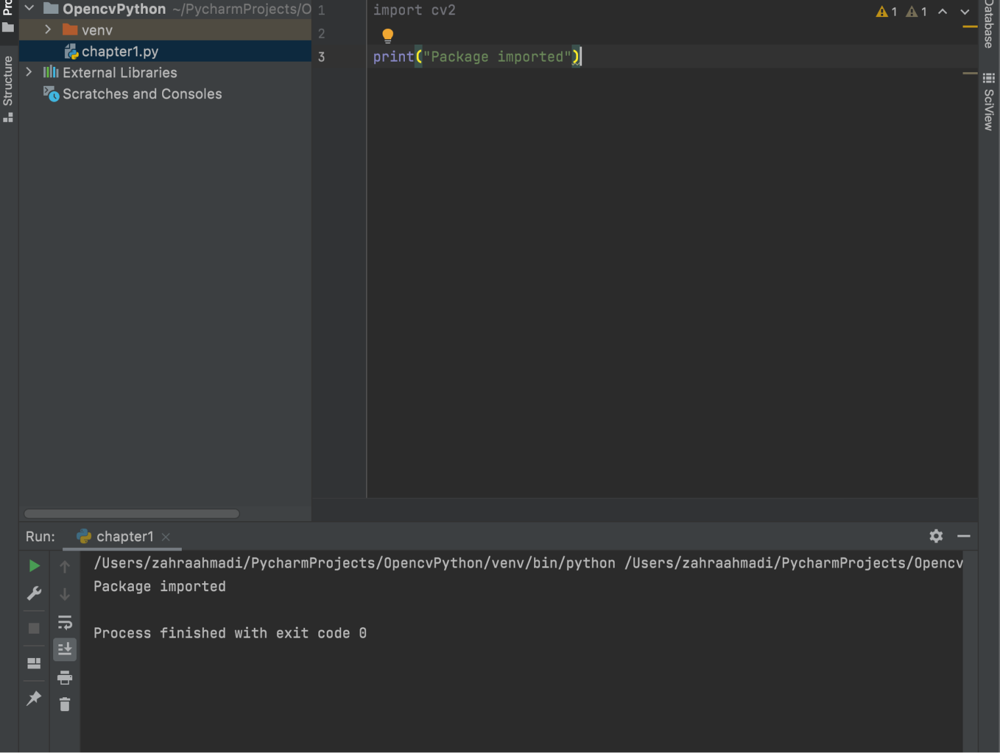

My console printed the text “Package imported”, which means that opencv is imported succesfully. Now it’s finally time to write the code!

## Step 5: Working with images

On the left we have our project with the files included. As you can see some files are automatically made by Pycharm, for example the ‘venv’ where the .gitignore file and some other files are placed. This is why I love using Pycharm, especially if you’re a beginner with writing Python code. Now you don’t have to do anything with those files. We’re going to dive straight into starting writing code.

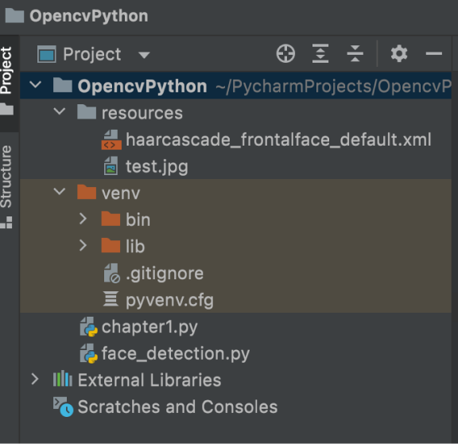

First we’re going to start with an easy example. We’re going to make Python search for an image file and open that for us. But for that to work we need a new Python file.

Right-click with your mouse on the Python project folder > new > Python file > Insert name.

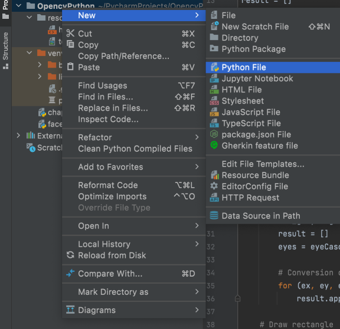
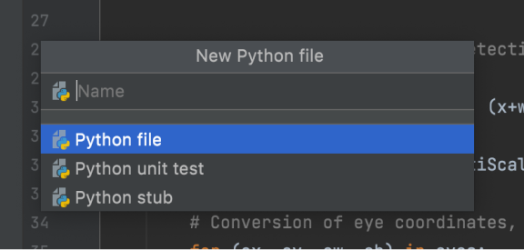

Now make a new folder within your project folder with the name “resources”. This will be needed for images and other files, like the Haarcascade we’re going to need for the face detection.

Right-click with your mouse on the Python project folder > Directory > Insert folder name.

For the first coding lesson we’re going to need an image. Include an image file in the resources folder. And write the following code:
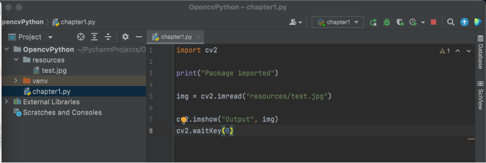

Run the code by clicking on the play button on top.
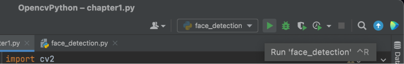

Now you get the image as an output. Congratulations! You’ve written your first lines of Python code.
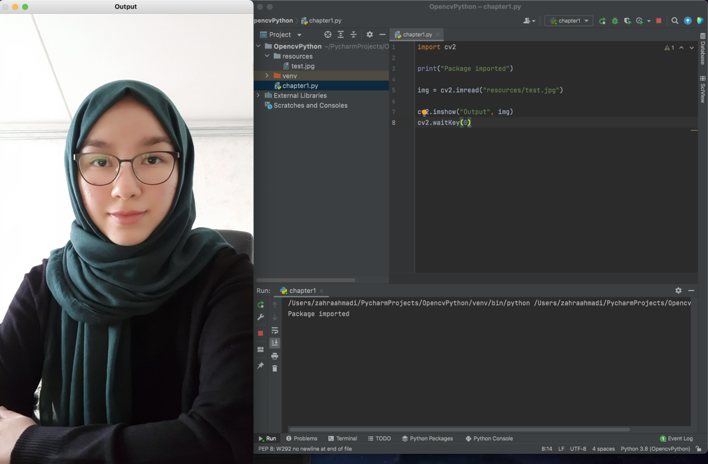

## Step 6: Working with webcam

We’re going to test the webcam as well, because we’re going to work on face detection later on. I had written this code and I got my first error.

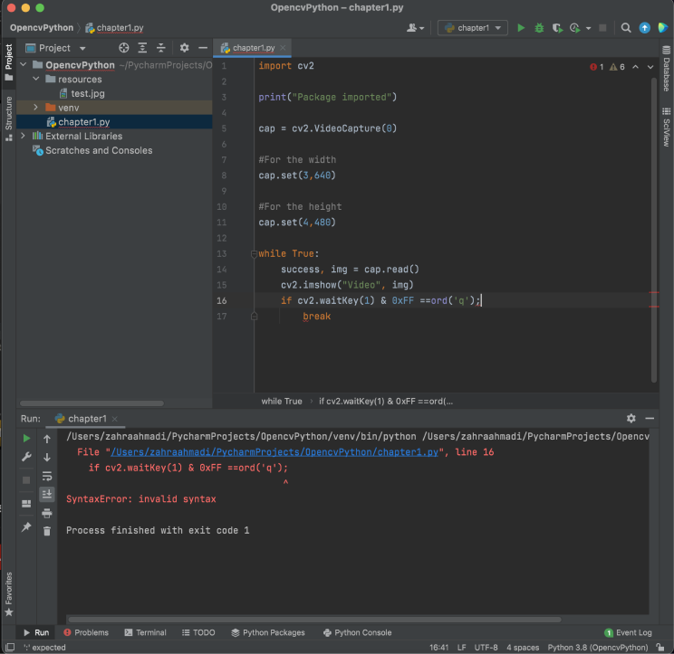
But Pycharm told me exactly what was going wrong and needed to be changed. It seemed to be this simple sign.

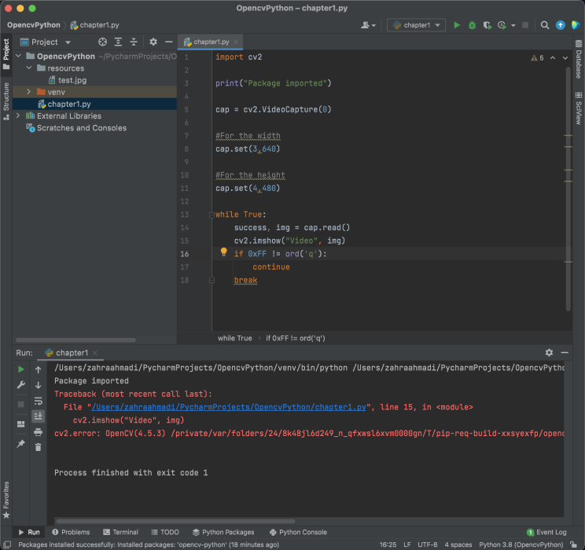
So I changed the ; sign to : and I got another error. I checked the error and it seemed like it couldn’t read the lines 7 to 11 correctly. Maybe the measurements weren’t right.

But I removed those lines of code, just to see if that was the problem. And suddenly it seemed to work!

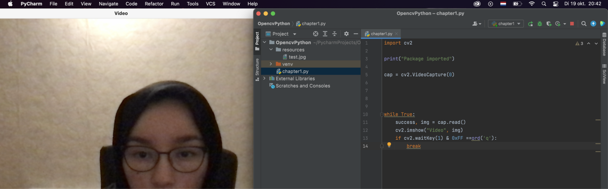

If you want to change the width and height, I would suggest to search more about it on the internet. For me this was just a test and I didn’t really need to have the ‘right’ measurements, so I moved on to the project I actually wanted to work on.

## Step 7: Download the Haarcascade file

Haarcascade files are needed for face, eye, body or other objects or body parts to be detected by the system. We are going to use the frontal face, because we’re going to work with the webcam.

1. Go to https://github.com/opencv/opencv/blob/master/data/haarcascades/haarcascade_frontalface_default.xml and click on Raw.

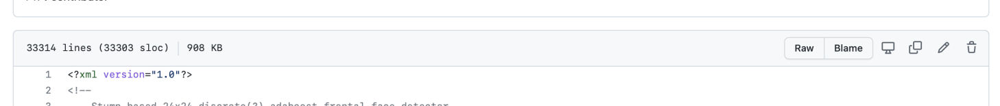

The file will now open as a web-file. Right-click with your mouse on the file and save it in the resources folder of your Python project.

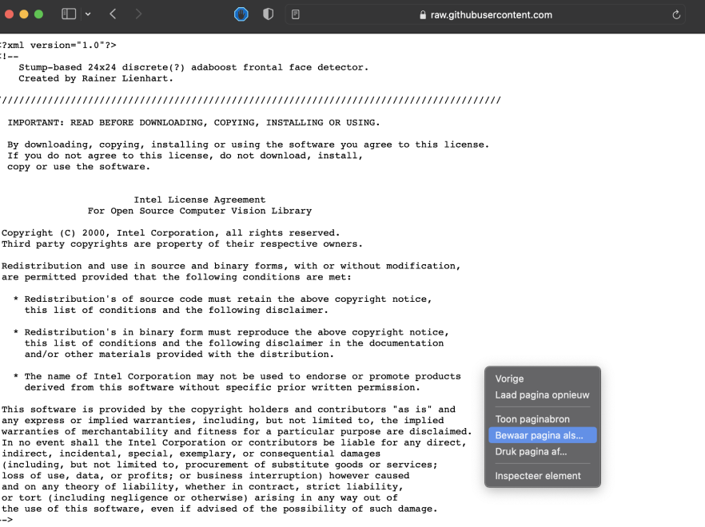

We’re all set! Let’s write the code for the face detection.

## Step 8: Write and run the code.

Write and run the following code. Mine didn’t work..

It looks like it can't find the Haarcascade file.
