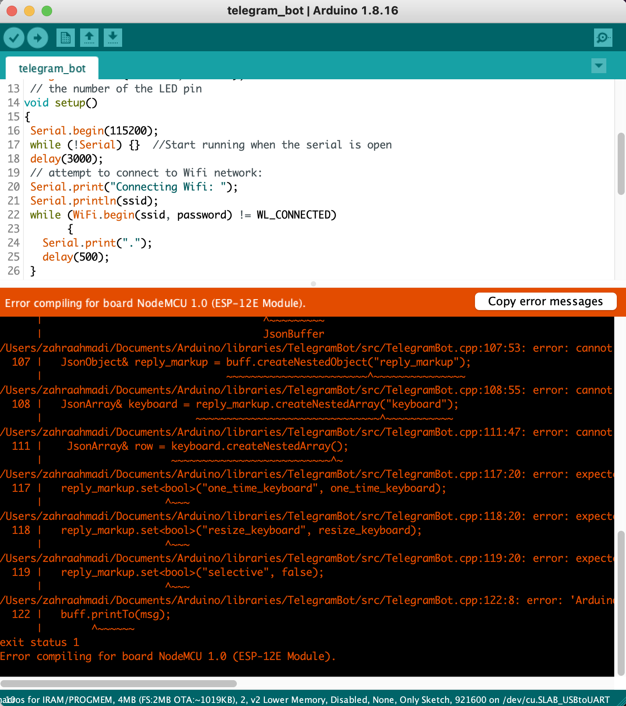
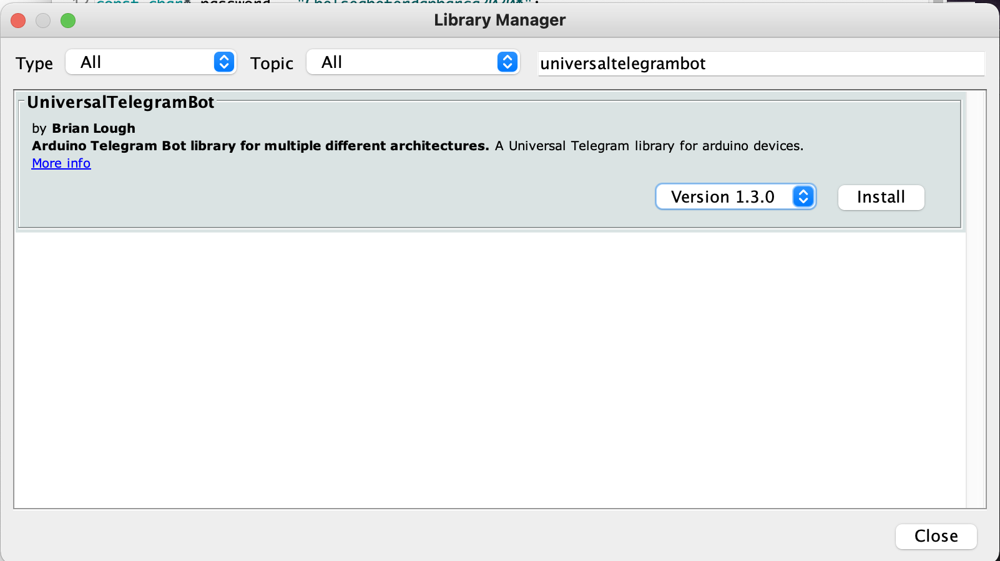
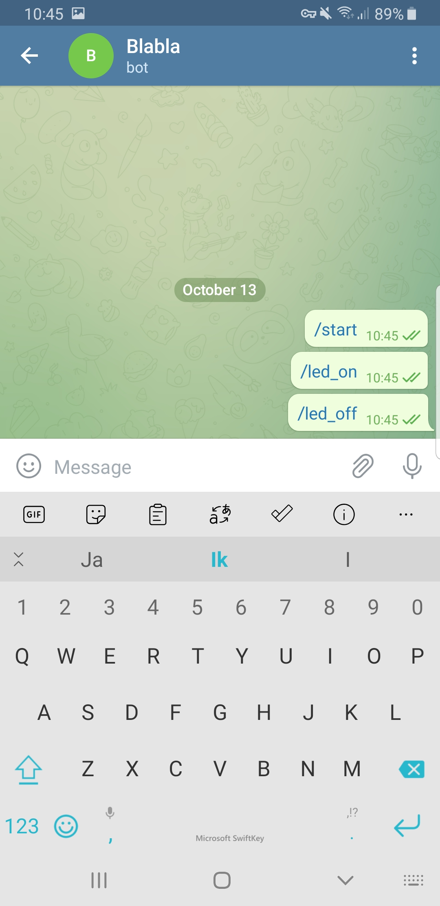

# Internet of Things - Tech Manual

Voor IoT heb ik gewerkt met NodeMCU. Deze heeft een geintegreerde Wifi module, namelijk de esp8266, en het draait op Arduino software. Voordat we met Arduino aan de slag kunnen gaan, moeten we het eerst installeren en de bijbehorende boardsettings goed instellen.

1. Installeer eerst [Arduino](https://www.arduino.cc/en/Main/Software). Verplaats het Arduino bestand naar je map met applicaties. Start Arduino vervolgens op.
2. Als tweede gaan we de USB driver installeren.

## Na de quickstart heb ik aan een aantal opdrachten gewerkt:

### LED kleur veranderen

Bij deze opdracht ben ik gaan kijken naar hoe ik de kleur en de snelheid van mijn ledstrip kan veranderen door middel van code. Het ging niet helemaal vlekkeloos. Het werkte eerst niet en ik kreeg errors. Mijn code leek geen probemen te hebben. Er was eerder iets mis met mijn board, dus ben ik gaan kijken naar mijn board en of ik alle draden goed had aangesloten. Dit bleek van niet. Ik had ze allemaal eruit gehaald en de tweede keer wat aandachtiger gekeken naar de kleine letters. Nadat ik het had aangesloten, ging ik de code nogmaals uploaden en dit keer werkte het wel! Zowel de kleur als de snelheid was veranderd.

### Adafruit IO

### Telegram Bot

Bij deze opdracht ben ik een Telegram Bot gaan activeren voor het aan- en uitzetten van de led op mijn Node MCU. Deze zou volgens commando's moeten gaan, echter lukte dat niet bij mij. Ik had de volgende [bron](https://randomnerdtutorials.com/telegram-control-esp32-esp8266-nodemcu-outputs/) gebruikt.

1. Ik had als eerst een Telegram Bot aangemaakt met Botfather.
2. Het wifinetwerk aangesloten.
3. De BotToken en de chat-ID in de code bijgevoegd.

Ik kreeg eerst een error:

Het bleek dat ik een library niet had geinstalleerd, dus heb ik dat ook gedaan:

Nadat ik de bovenstaande stappen had uitgevoerd en mijn ledlamp met de bot wilde besturen, lukte dat niet.

Ik had wel verbinding met het wifi-netwerk.

Na wat onderzoek kwam ik erachter dat het volgende stukje code niet goed geschreven was:
`const char BotToken = "2074720637:AAHs0U6tWqu0JWxoAQSHMJ0f4Dwnj05P31U";`

Dat heb ik veranderd naar het volgende:
`#define BotToken "2074720637:AAHs0U6tWqu0JWxoAQSHMJ0f4Dwnj05P31U"`
